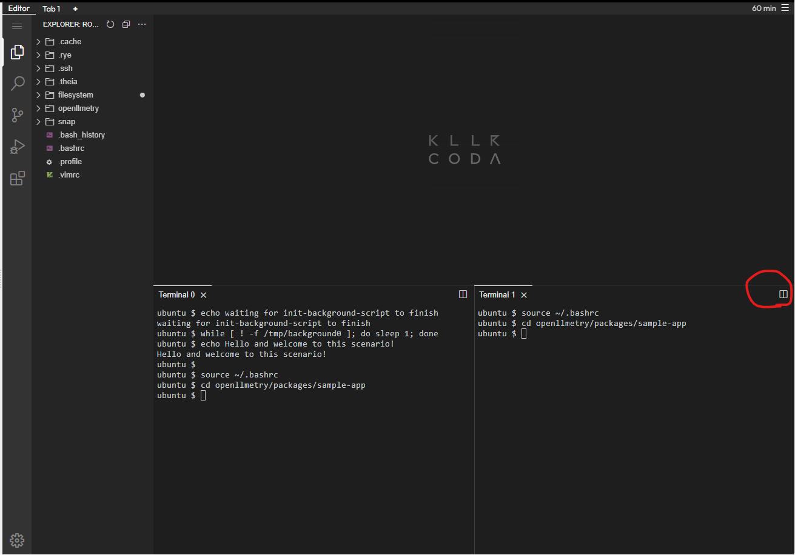

# Welcome

## Intorduction

This scenario is based on the [OpenLLMetry Getting Started](https://github.com/traceloop/openllmetry?tab=readme-ov-file#-getting-started).(As of July. 2024)

Let's get started.

In this scenario, you will create and run the python scripts of OpenLLMetry.
The official example applications code exists in [the repository](https://github.com/traceloop/openllmetry/tree/main/packages/sample-app), and it will be cloned automatically.

## Caution

This scenario is not READY. There may be a lot of errors when you follow the instructions.

## Preparation

For python execution, [rye](https://rye.astral.sh/) is under installing.
Wait until the terminal echoes `Hello...`{{}}, you may have to wait 3-4 minutes.

Please split the terminal. You will use the **right terminal for running APM service**.


```bash
source ~/.bashrc
cd openllmetry/packages/sample-app
```{{exec}}
