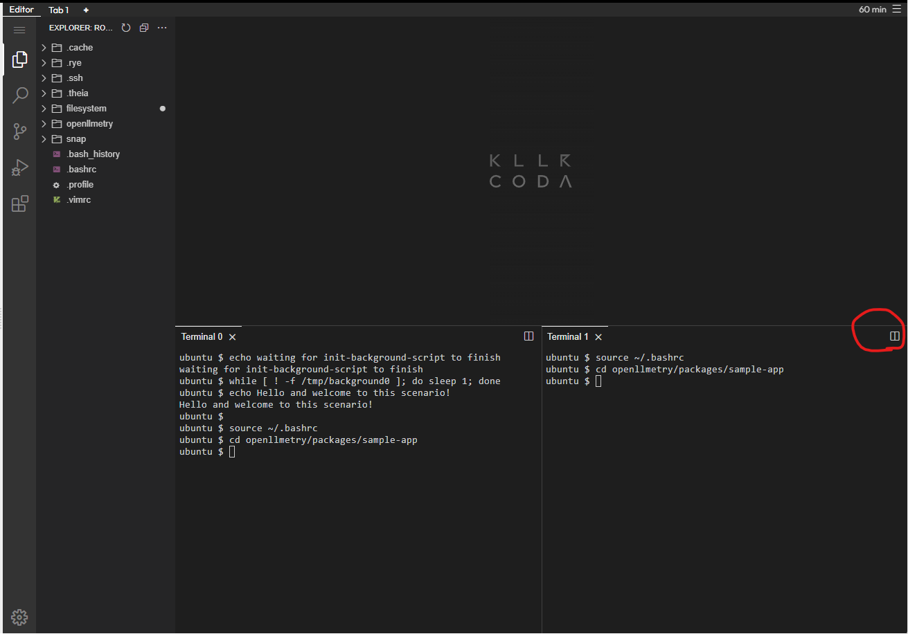

# Preparation

For python execution, [rye](https://rye.astral.sh/) is under installing.
Wait until the terminal echoes `Hello...`{{}}, you may have to wait 3-4 minutes.

Please split the terminal. You will use the **right-side☞ terminal for running APM service**.


Execute the command below in both terminals.

```bash
source ~/.bashrc
cd openllmetry/packages/sample-app
```{{exec}}

Please note that from the next page onward, when instructing commands to be executed in the right-side☞ terminal, a note stating ‘**Execute the command below in the right-side☞ terminal**’ will be included.
